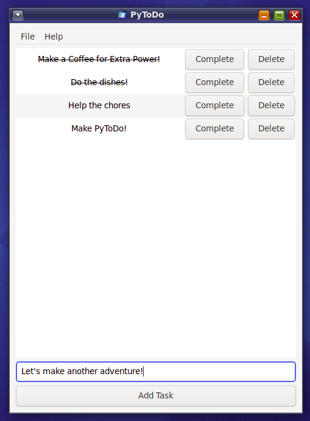

# PyToDo


A GTK-3 ToDo App written using Python 3 specifically for Linux

---

### Background

This project is actually part of my ToDo series projects in my repositories. After making series of ToDo on Windows, finally I'm working for a ToDo in Linux. But thankfully, creating GTK apps doesn't need a specific programming language, and I chose Python for it's simplicity and learning curve.

As this project is for my exploration and learning purposes, feel free to learn or improve this code for personal learning use.

---

### Features

This app has features required for ToDo, such as :

- Add ToDo

- Complete ToDo

- Delete ToDo

This app has upcoming feature that's still work in progress :

- Save ToDo to File

---

### Screenshot



Pic 1. PyToDo ran in OpenIndiana OS with MATE Desktop Environtment

---

### Building

Simply clone this git or download the main 3 files :

- pytodo.sh

- pytodo.py

- pytodo.png

Then simply run `./pytodo.sh` to test running it.

After that, compile the sh file using `shc` by typing:

```shell
shc -f pytodo.sh
```

It will then generate a `pytodo.sh.x.c` (a C code) and `pytodo.sh.x` (the executable). You could ignore the .c file and remove the file extensions from the `pytodo.sh.x` file.

Try giving it a `chmod +xrw pytodo` then running it.

---

### Installation and Running

#### Requirements

This app is built on Python and still need Python to be installed on system. Please make sure Python 3.x is installed and you could run ```python3``` on your Linux Terminal.

If your Linux distro don't have Python3 and you want to use Python 2 instead, you need to clone this git, edit the .sh file, rename `python3` to `python` and compile it.

#### Installation

There's a ready-to-run executable on Releases page. It's packaged as ZIP file, because it needs the PNG logo to be in the same folder as the app. After extracting, type this command in the terminal:

```shell
chmod +xrw ./runPyToDo
```

After running the command, you could simply type `./runPyToDo` in the terminal to run it, or if supported, double click the runPyToDo file.

Note: This is a GTK+3 application, and tested only on OpenIndiana (Mate) and Kubuntu 22.04 LTS (KDE). Other desktop environtments currently untested, so please tell me in issues page if something went wrong on other desktop environtment.

---

### Enhancement Planning

These are the planned enhancements that will be delivered in the next releases:

- Ability to save ToDo as .txt

- Packaged release, so the .png logo doesn't need to be in the same folder

- Packaged as DEB, RPM, PKG and even AppImage for better distribution

---

### Changelogs

v.1.0 - First Release
